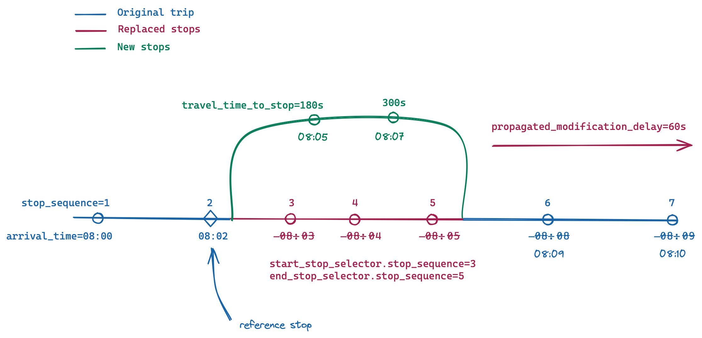
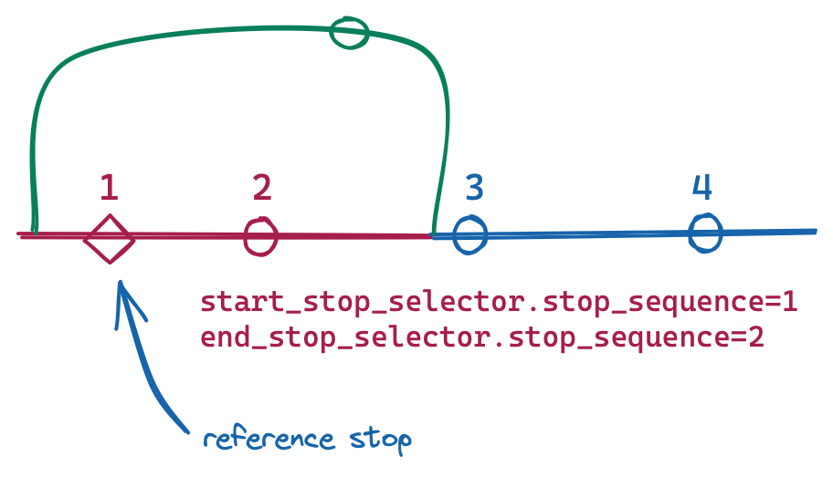

# Trip Modifications

A `TripModifications` message identifies a list of similar `trip_ids` from the (CSV) GTFS sharing the same stop pattern, which are all affected by particular modifications, such as a detour.

## SLO: Service-level objective

The frequency of data updates is expected to be approximately hourly (~24 times/day). Ingestion time may depend on the total number of affected trips. Consumers are expected to ingest a single TripModification within 5 minutes, and a feed with hundreds of detours within 20 minutes.

## TripModifications

The `TripModifications` is in effect on all of the listed service\_dates, until it is removed from the feed. On any given service date, a trip MUST NOT be assigned to more than one `TripModifications` object.

There MAY be multiple `TripModifications` for a given stop pattern. It may be desirable to split the trips into multiple modifications e.g. if the `propagated_modification_delay` changes significantly, over the course of the detour.

The trips created through GTFS-TripModifications modify and replace each specified `trip_id`, and don't create a copy or additional run. Modifications are applied on the schedule information, like if a static GTFS (CSV) was modified. 

The scheduled stop times of each replacement trip are created from those of the affected trip, by performing the changes listed in modifications. `stop_sequence` for all stop times are replaced by a new value of 1 to n, starting with 1 on the first stop_time and increasing by 1 for each stop in the trip. A `TripUpdate` message must be provided to publish real-time arrival/departure times for the replacement trip.

## Linkage to TripUpdates

* A TripUpdate SHOULD be provided using a `ModifiedTripSelector` inside the TripUpdate's `TripDescriptor`. 
    * When the TripUpdate refers to the replacement trip, the consumer should behave as if the static GTFS would have been modified with the TripModifications (e.g. `arrival_time`, `departure_time`, `stop_sequence`, `stop_id` on replacement stops)
    * Providing a TripUpdate with the a `ModifiedTripSelector` is the only way to create predictions at replacement stops
* If no such TripUpdate is found, TripUpdates for the original `trip_id` will apply to the modified trip. 
    * In this case, the static GTFS information used should be from the static GTFS before any TripModifications applied. 
    * Real time can be available to the common stops between the previous trip and the new modified trip, no ETA is available at the replacement stops.

##  Modification

A `Modification` message replaces a span of n stop times (`num_stops_replaced`) from each affected trip starting at `start_stop_sequence`. The spans of the modifications MUST not overlap. Spans may not be contiguous; in this case the two modifications MUST be merged into one.  These stop times are replaced with a new stop time for each replacement stop described by `replacement_stops`.

The sequence of `replacement_stops` may be of arbitrary length. For example, 3 stops could be replaced by 2, 4, or 0 stops as the situation may require.

_An example showing the effect of a modification on a particular trip. This modification may also be applied to several other trips._

_Propagated detour delays affect all stops following the end of a modification. If a trip has multiple modifications, the delays are accumulated._

## ReplacementStop

Each `ReplacementStop` message defines a stop that will now be visited by the trip, and optionally specifies the estimated travel time to the stop. The `ReplacementStop` message is used to construct the scheduled `stop_time` for the stop.

When `travel_time_to_stop` is specified, the `arrival_time` is calculated from a reference stop in the original trip, plus the offset in `travel_time_to_stop`. Otherwise, the `arrival_time` can be be interpolated based on the total duration of the modification in the original trip.

The `departure_time` always equals the `arrival_time`.

The optional fields of [`stop_times.txt`](https://github.com/google/transit/blob/master/gtfs/spec/en/reference.md#stop_timestxt) in the (CSV) GTFS specification are all set to their default values.

_If a modification affects the first stop of the trip, that stop also serves as the reference stop of the modification._

## Shape

Describes the physical path that a vehicle takes when the shape is not part of the (CSV) GTFS, such as for an ad-hoc detour. Shapes belong to Trips and consist of an encoded polyline for more efficient transmission.  Shapes do not need to intercept the location of Stops exactly, but all Stops on a trip should lie within a small distance of the shape for that trip, i.e. close to straight line segments connecting the shape points

## Stop

Represents a new Stop added to the feed dynamically. All fields are as described in the (CSV) GTFS specification. The location type of the new stop is `0` (routable stop).

