# Change Process

## Overview

The specification Change Process guides how the community proposes, reviews, and adopts changes to the specification in the [GTFS Repository](https://github.com/google/transit/pulls). 

The specification Change Process is divided into **2 main stages** and categorized into **3 tracks** according to the three [change types](../change-types): [functional changes](../change-types/#1-functional-changes), [non-functional changes](../change-types/#2-non-functional-changes), and [documentation maintenance](../change-types/#3-documentation-maintenance). 

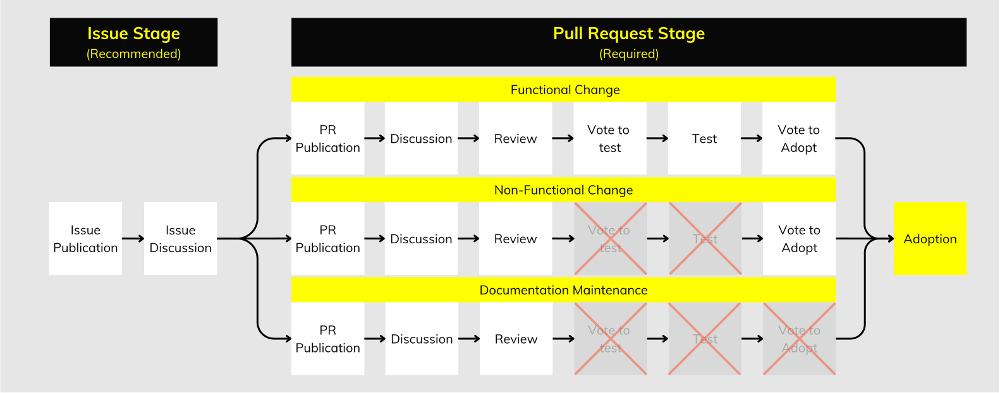

### Stage 1: Issue 

The Issue Stage is meant for discussing new ideas, identifying needs, and proposing improvements to the specification. Issues help evaluate the necessity and support for a change, while organizing the resources required to proceed to the Pull Request Stage. 

It’s recommended to start at the Issue stage to build consensus around new ideas. However, if the proposal’s scope is already well-defined, beginning directly at the Pull Request Stage is appropriate.

### Stage 2: Pull Request 

The Pull Request Stage is where ideas from the Issue Stage are developed and implemented into the specification. This stage is divided into 3 tracks depending on the change type. 

The entire process happens within the [GitHub google/transit repository](https://github.com/google/transit/pulls) and ensures that all changes are thoroughly evaluated before being adopted.

## Process Tracks

Depending on the type of the proposed change, different tracks apply to the Change Process. While the Issue Stage remains the same across all three tracks, the Pull Request Stage varies for each track.

### Track A: Functional Changes

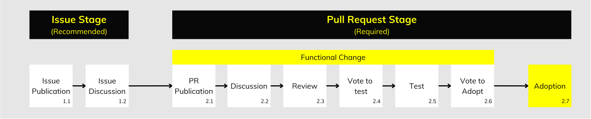

This process guides how the community proposes, reviews, and adopts [Functional changes](../change-types/#1-functional-changes) to the specification in the [GTFS Repository](https://github.com/google/transit/pulls). 

* A proposal is submitted by opening a Pull Request in the GTFS Repository.   
* The community engages in discussions to refine the proposal and reviews it before testing.   
* After a preliminary vote, [First Adopters](../roles/#first-adopter) test the proposed changes.   
* The community votes to decide whether the changes should be officially adopted.  
* Finally, changes are implemented into the specification.

### Track B: Non-Functional Changes

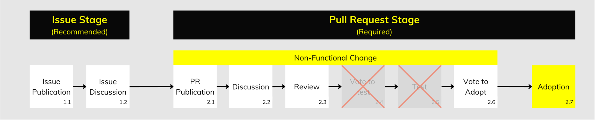

This process guides how the community proposes, reviews, and adopts [Non-Functional changes](../change-types/#2-non-functional-changes) to the specification in the [GTFS Repository](https://github.com/google/transit/pulls).

* A proposal is submitted by opening a Pull Request in the GTFS Repository.   
* The community engages in discussions to refine the proposal.  
* The community votes to decide whether the changes should be officially adopted.  
* Finally, changes are implemented into the specification.

### Track C: Documentation Maintenance

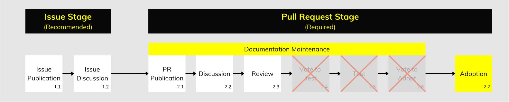

This process guides how the community proposes, reviews, and adopts [changes to maintain the documentation](../change-types/#3-documentation-maintenance) in the [GTFS Repository](https://github.com/google/transit/pulls).

* A proposal is submitted by opening a Pull Request in the GTFS Repository.   
* The community engages in discussions to refine the proposal  
* Finally, changes are implemented into the specification.

## Process Steps

All of the steps in the Issue and Pull Request Stages are highlighted below. Consider that only Track A utilizes all the steps. Track B and Track C utilize a shortened version of the process: 

|  | Track A: Functional Changes | Track B: Non-Functional Changes | Track C: Documentation Maintenance |
| ----- | :---: | :---: | :---: |
| **[Step 1.1: Issue Publication](#step-11-issue-publication)** | ✓ | ✓ | ✓ |
| **[Step 1.2: Issue Discussion](#step-12-issue-discussion)** | ✓ | ✓ | ✓ |
| **[Step 2.1: Pull Request Publication](#step-21-pull-request-publication)** | ✓ | ✓ | ✓ |
| **[Step 2.2: Pull Request Discussion](#step-22-pull-request-discussion)** | ✓ | ✓ | ✓ |
| **[Step 2.3: Pull Request Review](#step-23-pull-request-review)** | ✓ | ✓ | ✓ |
| **[Step 2.4: Vote to Test](#step-24-vote-to-test)** | ✓ |  |  |
| **[Step 2.5: Testing](#step-25-testing)** | ✓ |  |  |
| **[Step 2.6: Vote to Adopt](#step-26-vote-to-adopt)** | ✓ | ✓ |  |
| **[Step 2.7: Adoption](#step-27-adoption)** | ✓ | ✓ | ✓ |

### Step 1.1: Issue Publication

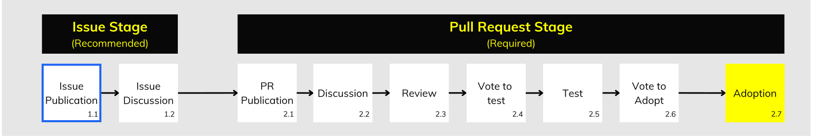

A [Contributor](../roles/#contributors) shares their idea to improve the specification by opening an Issue in [the GTFS Repository](https://github.com/google/transit/pulls). 

* Anyone can open an Issue to start a discussion.

**<ins>Actions</ins>** 

1. **Issue Submission**

    * A [Contributor](../roles/#contributors) posts an Issue describing an idea and the problem it would solve.

**<ins>Suggestions</ins>** 

| Suggestion | Details |
| :---- | :---- |
| **Use the Specification Change Template** | Fill in the fields with high-level descriptions using [the provided template](https://github.com/google/transit/issues/new?assignees=&labels=spec-change&projects=&template=spec_change.yml). |
| **Encourage Discussion** | The content doesn't have to be perfect; it should stimulate discussion and change as the conversation moves forward. |
| **Tag Interested Contributors** | Tag other contributors who might be interested in the discussion and share the issue on relevant platforms. |

### Step 1.2: Issue Discussion

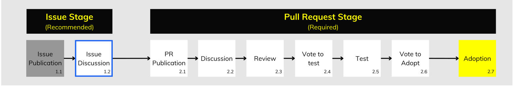

The community engages in discussions to help develop a proposal for modifying the specification, which will be submitted as a Pull Request in the next stage.

**<ins>Actions</ins>** 

1. **Issue Discussion**

    * [Contributors](../roles/#contributors) reply to the original Issue post and share their feedback.

2. **Working Group Proposal**

    * If necessary, any [Contributor](../roles/#contributors) can propose the creation of a Working Group to facilitate a discussion between all interested parties using video-conferencing software.  
    * The Working Group can be organized by any [Contributor](../roles/#contributors) or the [Maintainer](../roles/#maintainer).  
    * Discussions held in Working Group meetings should be summarized in the Issue comments.

**<ins>Suggestions</ins>** 

| Suggestion | Details |
| :---- | :---- |
| **Refine the Discussion Scope** | Focus the discussion on refining the scope of the proposal. |
| **Confirm Requirements** | Ensure that all necessary requirements for developing the proposal are confirmed. |
| **Gather Input** | Collect feedback from multiple contributors and assess overall support for the proposal. |
| **Summarize Discussions** | Regularly update the original post with the most recent points of discussion, such as: consensus reached, agreed scope, announcement of advocate and / or interested parties for testing.  |
| **Identify a potential Advocate** | Identify a contributor willing to develop the full proposal and take on the role of Advocate in the Pull Request Stage. |

### Step 2.1: Pull Request Publication

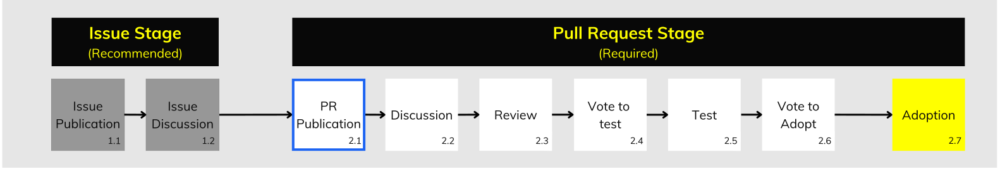

> Note: Applicable to all Tracks 

A proposal to change the specification is published by opening a Pull Request in [the GTFS Repository](https://github.com/google/transit/pulls). The [Advocate](../roles/#advocate) who publishes the proposal must focus on a single change; anyone is welcome to propose a modification.

**<ins>Actions</ins>** 

1. **Applying the Changes**

    * The [Advocate](../roles/#advocate) creates a [fork](https://docs.github.com/en/pull-requests/collaborating-with-pull-requests/working-with-forks/fork-a-repo#forking-a-repository) of the original [GTFS Repository](https://github.com/google/transit/pulls) to either their personal or their organization’s account.  
    * The [Advocate](../roles/#advocate) creates a branch in their fork and applies the proposed changes. 

2. **Pull Request Submission**

    * The [Advocate](../roles/#advocate) creates a [Pull Request](https://docs.github.com/en/pull-requests/collaborating-with-pull-requests/proposing-changes-to-your-work-with-pull-requests/creating-a-pull-request-from-a-fork) in the [GTFS Repository](https://github.com/google/transit/pulls) from their fork. 

**<ins>Requirements</ins>**

| Requirement | Details |
| :---- | :---- |
| **Single Change** | The Pull Request should focus on a single change at a time. |
| **Extended Description**  | The Pull Request must contain an extended description of the proposed change. It is recommended to follow the provided Pull Request templates. |
| **Change type** | The Advocate must specify the type of change (Functional, Non-Functional, or Documentation Maintenance) in the opening post of the Pull Request.   - Any contributor can flag a misclassified change at any time to ensure it follows the correct adoption track.  - If no consensus is reached, the Maintainer can provide clarification and recommend the appropriate track. |
| **Proposed Discussion Period** | The Advocate should specify a minimum estimated discussion period lenght based on the scope of the proposed change.   - Example: “I recommend reserving at least one month for discussion to ensure everyone has sufficient time to discuss the proposal.” |
| **Mailing List Announcement** | The Advocate must announce the creation of the Pull Request in the [GTFS Changes mailing list](https://groups.google.com/g/gtfs-changes), including: A brief description of the change and a link to the Pull Request. |

### Step 2.2: Pull Request Discussion

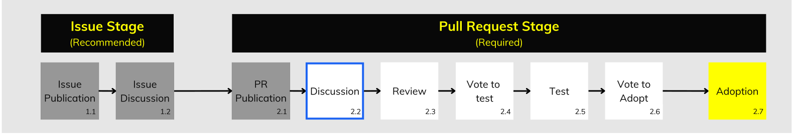
  
> Note: Applicable to all Tracks 

The community engages in conversations to help refine and develop the proposal.

**<ins>Actions</ins>** 

1. **Proposal Discussion**

    * [Contributors](../roles/#contributors) discuss the proposal in the Pull Request comment section.

2. **Proposal Updates**

    * The [Advocate](../roles/#advocate) updates the proposal’s contents based on the comments received.

3. **Working Group Proposal**

    * If necessary, any [Contributor](../roles/#contributors) can propose the creation of a Working Group to facilitate a discussion between all interested parties using video-conferencing software.  
    * The Working Group can be organized by either the [Advocate](../roles/#advocate) or the [Maintainer](../roles/#maintainer).  
    * Discussions held in Working Group meetings should be summarized in the Pull Request comments.

**<ins>Requirements</ins>** 

| Requirement | Details |
| :---- | :---- |
| **Minimum Discussion Period**  | The discussion lasts for as long as the Advocate deems necessary, but must be at least 7 full calendar days. |
| **Contributor License Agreement** | All contributors, including the Advocate, who make edits to the proposal must sign the [Contributor License Agreement](https://github.com/google/transit/blob/master/CONTRIBUTING.md#before-you-contribute). |

### Step 2.3: Pull Request Review

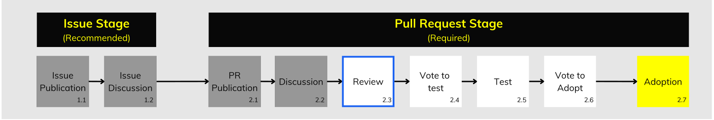

> Note: Applicable to all Tracks 

The community provides feedback to the [Advocate](../roles/#advocate) to prepare the proposal for testing. 

**<ins>Actions</ins>** 

1. **Review Period Announcement**

    * The [Advocate](../roles/#advocate) announces the start of the review period in the Pull Request comment section.

2. **Maintainer’s Review**

    * The [Maintainer](../roles/#maintainer) reviews the Pull Request to ensure the terminology aligns with the current specification.   
    * The [Maintainer](../roles/#maintainer) can either suggest changes in the comments or confirm the language is correct, prompting the [Advocate](../roles/#advocate) to adjust as needed and proceed to the next step.

3. **Contributor Feedback**

    * [Contributors](../roles/#contributors) can also review the Pull Request during this period and provide feedback to help the [Advocate](../roles/#advocate) make any final adjustments before testing.

**<ins>Requirements</ins>** 

| Requirement | Details |
| :---- | :---- |
| **Minimum Review Period**  | The review lasts for as long as the Advocate deems necessary, but must be at least 7 full calendar days.  - No minimum review period requirement for Documentation Maintenance Track. |

### Step 2.4: Vote to Test 

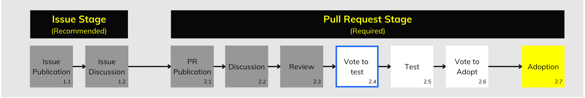

> Note: Not applicable to Track B: Non-Functional Changes and Track C: Documentation Maintenance

The community votes to confirm consensus on the proposal’s scope and to ensure it is technically sound enough to proceed to testing.

**<ins>Actions</ins>** 

1. **Vote announcement**

    * The [Advocate](../roles/#advocate) announces the beginning of the vote in the Pull Request comment section, specifying the end time of the vote.  
    * The [Advocate](../roles/#advocate) announces the vote in the [GTFS Changes mailing list](https://groups.google.com/g/gtfs-changes) discussion thread providing a link to the Pull Request comment and the end time of the vote.

2. **Voting Process**  
     
    * [Contributors](../roles/#contributors) must vote in the comment section of the Pull Request.

3. **Editing and Canceling**  
     
    * The [Advocate](../roles/#advocate) can edit the proposal only for editorial purposes during the voting period. Any other change would require restarting the voting process.  
    * The [Advocate](../roles/#advocate) can cancel the vote at any time.  
    
4. **End of Vote Announcement**  
     
    * The [Advocate](../roles/#advocate) announces the end of the vote in the Pull Request comment section and includes the result.  
    * The [Advocate](../roles/#advocate) also announces the end of the vote in the [GTFS Changes mailing list](https://groups.google.com/g/gtfs-changes) discussion thread, including the result.

5. **Failed Vote**  
     
    * If the vote fails, the [Advocate](../roles/#advocate) can choose to:  
        1. Continue working on the proposal, or  
        2. Abandon the proposal.  
    * The [Advocate](../roles/#advocate) must announce their decision in the Pull Request comment section and in the [GTFS Changes mailing list](https://groups.google.com/g/gtfs-changes) discussion thread.

**<ins>Requirements</ins>** 

The vote must meet the following conditions:

| Requirement | Details |
| :---- | :---- |
| **Consensus Principle** | The vote is based on **unanimous consensus**. |
| **Vote Passing Criteria** | The vote passes when all contributors vote **\+1**. |
| **Vote Failing Criteria** | The vote fails when any contributor votes **\-1**. |
| **Voting Format** | Votes must be formatted as follows:  - *“+1 or \-1, Organization Name, Contributor Type (Consumer, Producer, or General Contributor), Link to Produced Feed or Consuming Application”* |
| **Voting Against** | Contributors providing a negative vote (-1) must give actionable feedback.  - Actionable feedback is practical and constructive, providing concrete observations or suggestions to help solve the identified issue:    - “*This proposal does not respect the backward compatibility principle of GTFS and we propose to create a separate file instead.*” |
| **Minimum Votes** | At least 5 votes must be cast. |
| **Participant Composition** | At least 2 consumers and 2 producers must participate in the vote. |
| **Advocate's Vote** | The Advocate cannot vote for their own proposal. |
| **Invalid Votes** | Votes are considered invalid if:   - A contributor casts their vote outside (before or after) the official voting period.  - An individual or organization votes more than once (Only one vote per individual or organization is permitted.)  |
| **Minimum Voting Period**  | The voting period must last at least **14 full calendar days** and end at **23:59:59 UTC**. |

### Step 2.5: Testing

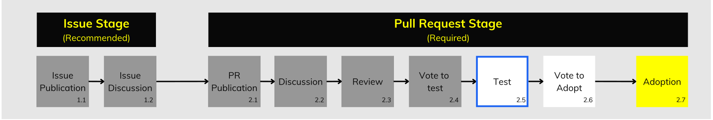

> Note: Not applicable to Track B: Non-Functional Changes and Track C: Documentation Maintenance

One GTFS [Producer](../roles/#producers) and one GTFS [Consumer](../roles/#consumers) volunteer to serve as [First Adopters](../roles/#first-adopter) by implementing the proposed changes for testing.

**<ins>Actions</ins>** 

1. **Tester Confirmation**  
     
    * The [Advocate](../roles/#advocate) confirms the identity of the [First Adopters](../roles/#first-adopter) which will test the changes in the Pull Request comment section.  
    
2. **Testing**

    * The [First Adopters](../roles/#first-adopter) apply and test the changes in a public-facing environment.  
    * Testing lasts as long as necessary to ensure that all requirements are met before calling a vote to adopt.

3. **Proof of Testing**

    * The [First Adopters](../roles/#first-adopter) show proof of testing by sharing a link to the implemented changes in the pull request comments.

**<ins>Requirements</ins>** 

The [Advocate](../roles/#advocate) can proceed with a Vote to Adopt ([step 2.6](#step-26-vote-to-adopt)) only after all requirements of the testing period have been completed.

| Requirement | Details |
| :---- | :---- |
| **Minimum Testing Period**  | The testing period must last **at least 7 full calendar days**. |
| **Tester Participation** | At least 1 Consumer and 1 Producer must apply and test the proposed changes. |
| **Problem identification during testing** | First Adopters testing the changes must report any identified issues by commenting on the Pull Request, ideally with a suggested solution, to allow the Advocate to make necessary adjustments to the proposal.  - If the change significantly impacts the proposal’s scope, any Contributor may flag it, prompting the Advocate to either return the proposal to the discussion step ([step 2.2](#step-22-pull-request-discussion)) or consider withdrawing it. |
| **Testing Proof** | First Adopters must apply, test, and share changes in a public-facing environment:   - a link to a public-facing GTFS feed for Producers  - a public-facing link to a GTFS consuming application for Consumers.  |

### Step 2.6: Vote to Adopt

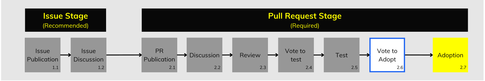

> Note: Not applicable to Track C: Documentation Maintenance

The community votes to confirm whether or not the proposed changes are to be officially adopted into the specification.

**<ins>Actions</ins>** 

1. **Announcement of Vote**  
     
    * The [Advocate](../roles/#advocate) announces the beginning of the vote in the Pull Request comment section, specifying the end time of the vote.  
    * The [Advocate](../roles/#advocate) announces the vote in the [GTFS Changes mailing list](https://groups.google.com/g/gtfs-changes) discussion thread providing a link to the Pull Request comment and the end time of the vote.  
    
2. **Voting Process**  
     
    * [Contributors](../roles/#contributors) must vote in the comment section of the Pull Request.  
    
3. **Editing and Canceling**  
     
    * The [Advocate](../roles/#advocate) can edit the proposal only for editorial purposes during the voting period.  
    * The [Advocate](../roles/#advocate) can cancel the vote at any time.  
    
4. **End of Vote Announcement**  
     
    * The [Advocate](../roles/#advocate) announces the end of the vote in the Pull Request comment section and includes the result.  
    * The [Advocate](../roles/#advocate) also announces the end of the vote in the [GTFS Changes mailing list](https://groups.google.com/g/gtfs-changes) discussion thread, including the result.

5. **Failed Vote**  
     
    * If the vote fails, the [Advocate](../roles/#advocate) can choose to either:  
        1. Adjust proposal based on actionable feedback provided and call another vote,  
        2. Go back to the discussion step ([step 2.2](#step-22-pull-request-discussion)) and redefine the scope, or  
        3. Abandon the proposal.  
    * The [Advocate](../roles/#advocate) must announce their decision in the Pull Request comment section and in the [GTFS Changes mailing list](https://groups.google.com/g/gtfs-changes) discussion thread.

**<ins>Requirements</ins>** 

The vote must meet the following conditions:

| Requirement | Details |
| :---- | :---- |
| **Consensus Principle** | The vote is based on **a qualified majority** (80% majority) |
| **Vote Passing Criteria** | The vote passes when 80% or more of contributors vote **\+1**. |
| **Vote Failing Criteria** | The vote fails when more than 20% of contributors vote **\-1**. |
| **Voting Format** | Votes must be formatted as follows:  - *“+1 or \-1, Organization Name, Contributor Type (Consumer, Producer, or General Contributor), Link to Produced Feed or Consuming Application”* |
| **Voting Against** | Contributors providing a negative vote (-1) must give actionable feedback.  - Actionable feedback is practical and constructive, providing concrete observations or suggestions to help solve the identified issue:    - “*This proposal does not respect the backward compatibility principle of GTFS and we propose to create a separate file instead.*” |
| **Minimum Votes** | At least 5 votes must be cast. |
| **Participant Composition** | At least 2 consumers and 2 producers must participate in the vote. |
| **Advocate's Vote** | The Advocate cannot vote for their own proposal. |
| **Invalid Votes** | Votes are considered invalid if:   - A contributor casts their vote outside (before or after) the official voting period.  - A contributor votes more than once (Only one vote per contributor is permitted.)  |
| **Minimum Voting Period**  | The voting period must last at least **14 full calendar days** and end at **23:59:59 UTC**. |

### Step 2.7: Adoption

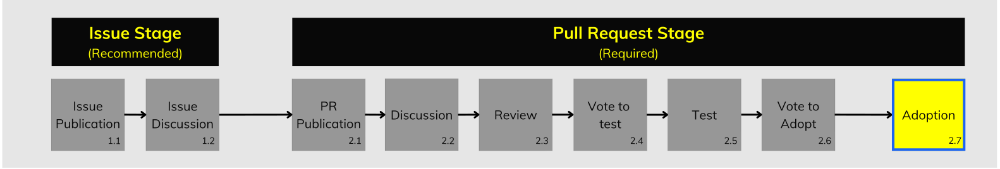
  
> Note: Applicable to all tracks.

The [Maintainer](../roles/#maintainer) implements the changes officially adopted after a successful vote.

**<ins>Actions</ins>** 

1. **Implementation**

    * If the vote passes, the [Maintainer](../roles/#maintainer) merges the voted Pull Request within 14 calendar days, provided that the [Contributors](../roles/#contributors) have signed the Contributor License Agreement.

2. **Revision History update**

    * The [Maintainer](../roles/#maintainer) documents all changes adopted after a successful vote in the Revision History once a month.

**<ins>Requirements</ins>** 

| Requirement | Details |
| :---- | :---- |
| **Implementation** | The Maintainer should merge every change that has been officially adopted within 14 calendar days |
| **Revision History** | The Maintainer should update the Revision History of the Specification monthly, documenting all recently adopted changes, along with a brief description and a link to the relevant discussion for each change. Documentation Maintenance changes are excluded from this requirement, but can be added to the Revision History if deemed valuable. |
