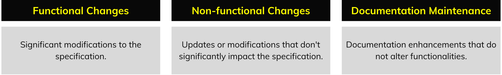

# Change Types

Proposed changes to the specification are categorized based on their impact on its functionality and interpretation. Each category follows a specific process before being officially adopted into GTFS.

## 1. Functional changes

Functional changes refers to modifications that significantly affect specification functionalities. These changes typically require testing and include adding new elements (files, fields, enums) or modifying existing ones. Such changes have to follow the complete specification [Change Process](../change-process) in order to be officially adopted.

Past Examples:

* [PR #405](https://github.com/google/transit/pull/405) adds two new files networks.txt and route_networks.txt.  
* [PR #385](https://github.com/google/transit/pull/385) adds a new option for the field fare_media_type in fare_media.txt.

## 2. Non-Functional changes

Non-functional changes refer to important updates to the specification that do not significantly affect functionalities. These changes typically do not require testing and they include the update of requirements, the addition or modification of best practices and any non-editorial modification to the governance framework.

### Requirement updates 

Modifications that do not introduce substantial changes to existing functionalities but affect the implementation and compliance of current elements within the specification. This includes, updates to presence types for files and fields, and adjustments to file requirements. 

* Past Examples:   
    * [PR #472](https://github.com/google/transit/pull/472) changes stops.txt presence from Required to Conditionally Required.  
    * [PR #379](https://github.com/google/transit/pull/379) adds a new requirement for all GTFS datasets.

### Governance

Changes to the processes and guidelines governing the management of the specification include updates to the [Change Process](../change-process), modifications to [Roles and Responsibilities](../roles) and [Change Types](../change-types), revisions to the [Guiding Principles](../guiding-principles), and adjustments to any other document related to the [governance framework](../intro). These updates ensure clear and effective management practices.

* Past Examples:   
    * [PR #387](https://github.com/google/transit/pull/387) updates the specification change process to switch from Swiss business days to calendar days only.

### Best practices

Changes enhancing specific parts of the specification by incorporating recommendations through the use of "should" statements. These updates provide guidance on preferred approaches or methods, encouraging users to follow best practices while maintaining flexibility in the specification's application.

* Past Examples:  
    * [PR #485](https://github.com/google/transit/pull/485) creates a new best practice to add that headsigns are recommended.  
    * [PR #406](https://github.com/google/transit/pull/406) introduces the Dataset Publishing guidelines and Practice Recommendations for all files into the specification

## 3. Documentation maintenance

Specification changes that focus on maintaining the documentation are made to improve the specification's clarity, accuracy, and presentation without altering its semantics or functionality. These updates may involve expanding existing content to provide clearer descriptions while preserving the specification’s current interpretation. These changes require a review, but they can be adopted without the need of a vote.

### Editorial 

These involve correcting grammar, spelling, punctuation, typographical errors, and outdated links. They also include documenting adopted changes in the revision history and making formatting adjustments. Editorial updates for Governance-related files are included in this category.

* Past Examples:  
    * [PR #506](https://github.com/google/transit/pull/505) Updates the revision history for the month of September 2024  
    * [PR #361](https://github.com/google/transit/pull/361) Fixes a broken link in fare\_rules.txt  
    * [PR #412](https://github.com/google/transit/pull/412) Changes the location of an existing misplaced requirement.

### Clarifications & Examples

Clarifications expand on specific points to improve understanding, add necessary context, and provide examples that demonstrate how to apply the specification. These updates ensure users can interpret and follow it correctly without altering its intended functionality.

* Past Examples:  
    * [PR #443](https://github.com/google/transit/pull/443) adds links to example pages that supplement the information in the reference document  
    * [PR #426](https://github.com/google/transit/pull/426) modifies the definition of fare products to reflect its intended use.