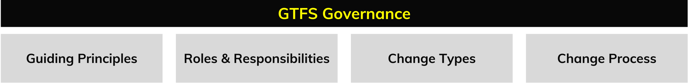

# Introduction to GTFS Governance

The GTFS standard is not set in stone; it is an open specification developed and maintained by a community of transit agencies, developers, and other stakeholders who actively use it. As this community of GTFS data producers and consumers continues to evolve, proposals for extending the specification to support new capabilities are expected. To manage this process, a GTFS governance framework has been established.

GTFS governance refers to the framework that guides how the GTFS is maintained, updated, and developed. It encompasses the rules and processes that the community has established to guide decision-making, ensuring that GTFS remains an open and collaborative data standard.

The governance framework for GTFS is composed of the following elements:

* [Guiding principles](guiding-principles.md)  
* [Roles and responsibilities](roles.md)  
* [Change types](change-types.md)
* [Change process](change-process.md)

Notably, the GTFS Change Process is the procedure by which modifications or additions to GTFS are proposed, discussed, and approved by the community. This process ensures that the specification evolves in a stable, predictable and collaborative way.

## What is a specification change?

A change refers to any proposed modification to the GTFS documentation hosted in the [Google/transit repository](https://github.com/google/transit). Such changes may include adding new functionalities, updating existing files or fields, clarifying guidelines, or improving examples. **In essence, proposing a change means proposing to change the content of any file associated with the documentation, most notably the Reference.md file, to enhance or expand the specification.**

## How can I start participating?

Anyone can contribute to the development of GTFS. Typically, anyone with a suggestion or idea for improving the specification follows the steps outlined in the [Change process](change-process.md) to refine and advance their proposal.

To navigate the process effectively, it's important to understand the different [types of changes](change-types.md) which determine the specific steps that need to be taken. Thus, it’s recommended that contributors familiarize themselves with these change categories, as well as the [roles and responsibilities](roles.md), to better understand their participation and involvement.

### What does the change process typically look like?

As mentioned above, different [types of changes](change-types.md) follow different processes. Below is an overview of the process for [Functional changes](change-types.md/#functional-changes), which outlines how the community proposes, reviews, tests, and adopts Functional changes to the GTFS specification.

| Action                      | Description                                                                                                  | Time            | Conditions                                                                                         |
| --------------------------- | ------------------------------------------------------------------------------------------------------------ | --------------- | -------------------------------------------------------------------------------------------------- |
| Submit Proposal             | A Pull Request (PR) is opened in the GTFS repository to propose the change.                                  | —               | Anyone can submit a proposal.                                                                      |
| Community Discussion        | Community discusses and refines the proposal.                                                                | Minimum 7 days  | Open participation.                                                                                |
| Review Period               | Contributors and the Maintainer review the proposal for clarity, feasibility, and alignment with GTFS goals. | Minimum 7 days  | Maintainer and Contributors must review.                                                           |
| Vote to Approve for Testing | Community votes to determine whether the proposal is ready for testing.                                      | Minimum 14 days | At least 5 contributors, including ≥2 Producers and ≥2 Consumers; all must vote in favor.          |
| First Adopters Testing      | Selected First Adopters test the proposed changes in real-world or simulated environments.                   | Minimum 7 days  | At least 1 Producer and at least 1 Consumer must test the changes.                                 |
| Final Vote for Adoption     | Community votes to officially adopt the change. Requires 80%+ approval to pass.                              | Minimum 14 days | At least 5 contributors, including ≥2 Producers and ≥2 Consumers; at least 80% must vote in favor. |
| Adoption                    | The approved change is officially added to the GTFS specification by the Maintainer.                         | —               | The Maintainer updates the official documentation                                                  |

There are shortened processes for [Non-Functional changes](change-types.md/#non-functional-changes) and [Documentation Maintenance](change-types.md/#documentation-maintenance). For more details, see the full [Change Process](change-process.md).
