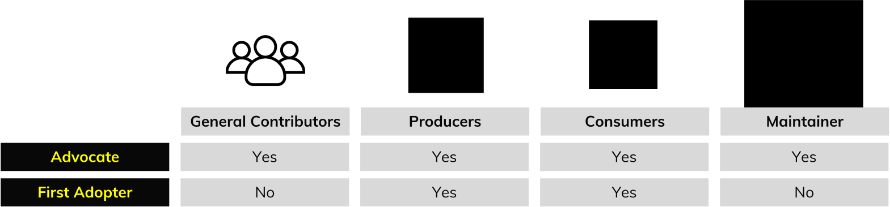

# Roles and Responsibilities

The community is composed of two main stakeholder categories: [Contributors](#contributors) and the [Maintainer](#maintainer). 

## Contributors

Anyone can become a Contributor by participating in discussions within the official GTFS repository, regardless of their technical skills or experience with GTFS.

**Responsibilities**

* Track development progress, participate in discussions, and review Issues and Pull Requests.   
* Express their views with respect and understanding, adhering to the GTFS Guiding Principles.

### Contributor Types

#### Producers

A GTFS Producer is an individual or organization responsible for generating GTFS data. This may include transit agencies, data vendors, aggregators, or planners.

* If GTFS feed production is assigned to another party, only one of the two may be recognized as the Producer for voting purposes.  
* To vote, Producers must reference a single GTFS feed they are responsible for. This follows the "One Organization, One Feed, One Vote" principle, which ensures each feed is represented only once in the process.
* Contributors who qualify as both a Producer and a Consumer may only vote in one role and must select which role to represent during testing and voting.

#### Consumers

A GTFS Consumer is an individual or organization that ingests GTFS data, typically to provide and distribute rider-facing transit information through platforms such as software applications.

* Some contributors may use GTFS data for research, analysis, planning, or operations. These contributors are considered Consumers only if their work is publicly accessible or shared in a public-facing context.  
* To vote, Consumers must reference the GTFS-consuming application they represent.
* Contributors who qualify as both a Consumer and a Producer may only vote in one role and must select which role to represent during testing and voting.

#### General Contributors

Individuals or organizations that do not qualify as either Producers or Consumers are considered General Contributors. These may include researchers, advocates, software developers, or other interested community members. General Contributors may also vote in proposals.

## Maintainer

The Maintainer supports and facilitates the specification [Change Process](change-process.md), and their role as an impartial facilitator is to guide the community toward making consensus-driven decisions. MobilityData currently serves as the Maintainer of GTFS. 

**Responsibilities**:

* Assist [Advocates](#advocate) in facilitating discussions when needed.   
* Provide constructive feedback and recommendations to help refine proposals.  
* Check that the terminology used in specification proposals aligns with the one used in the official specification.  
* Ensure all GTFS Contributors follow the governance framework by monitoring and moderating community interactions.  
* Can act as the [Advocate](#advocate) for proposals.  
* Assume the role of the [Advocate](#advocate) if they become unresponsive at any point.  
* Cannot participate in any voting process. 

## Special roles

General Contributors, Producers, Consumers and the Maintainer can take on special roles to support the development of specification changes. The [Advocate](#advocate) and [First Adopter](#first-adopter) roles are particularly critical for the [Change Process](../change-process) to function effectively.

### Advocate

An Advocate proposes a change to the official specification by publishing a Pull Request. Anyone can be an Advocate.

**Responsibilities**

* Follows the requirements of the [Change Process](change-process.md) for the proposed change.  
* Request assistance from the Maintainer if necessary. 

### First Adopter

First Adopters are Producers and Consumers who implement and test proposed changes as agreed upon in discussions. 

**Responsibilities**:

* Communicate any modifications or challenges that arise during testing.  
* Publicly publish proof of implementation in the Pull Request.  
* A consumer acting as a first adopter must guarantee that the GTFS data is tested using a rider-facing application. 
