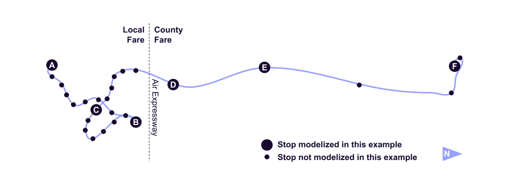

# Data Examples

## Introduction

These GTFS Data Examples are meant to ease comprehension of the GTFS specification and its different extensions. They provide data samples based on real-life transit systems throughout the world. These examples have been generated by MobilityData in order to facilitate both production and consumption of GTFS data by anyone.

## GTFS-ContinuousStops

### Example A - Pickup and drop-off everywhere!

[Source: pdf schedules available at [https://crtransit.org/bus-schedules/](https://crtransit.org/bus-schedules/)]

The transit agency The Current (Rockingham, US-VT) applies a continuous-stop policy on the routes 2, 53, and 55. A rider may request to be picked up and dropped off between scheduled stops all along the route, as soon as there is a safe place for the bus to stop.

Using **GTFS-ContinuousStops**, the data would be:

[File routes.txt](../reference.md#routestxt)

```
route_id,route_short_name,route_long_name,route_type,continuous_pickup,continuous_drop_off
2,2,Bellows Falls In-Town,3,0,0
53,53,Bellows Falls / Battleboro Commuter,3,0,0
55,55,Bellows Falls / Springfield Shuttle,3,0,0
```

If the transit agency wants to emphasize that a coordination between the bus driver and the rider must occur, such as hand waving for being picked up or asking the bus driver for being dropped off, the data would be:

[File routes.txt](../reference.md#routestxt)

```
route_id,route_short_name,route_long_name,route_type,continuous_pickup,continuous_drop_off
2,2,Bellows Falls In-Town,3,3,3
53,53,Bellows Falls / Battleboro Commuter,3,3,3
55,55,Bellows Falls / Springfield Shuttle,3,3,3
```

### Example B - Continuous pickup and drop-off on a route section
[Source: pdf schedules available at [https://vvta.org/routes/route-22/](https://vvta.org/routes/route-22/)]

The transit agency Victor Valley Transit (Victorville, US-CA) applies a continuous-stop policy only on a part of route 22. A rider may board and get off the bus in any safe location within the County Fare zone. This behavior is not allowed within the Local Fare zone. On northbound trips, the bus 22 starts in the Local Fare zone at Victorville Transfer Center (A) and ends in the County Fare zone at Silver Lakes Market (F).



#### Example B1:  Continuous pickup and drop-off starting from a scheduled stop
`National Trails Highway - Air Expressway` is the first scheduled stop in the County Fare zone, from which the continuous pickup and drop-off is available.

Using **GTFS-ContinuousStops**, the data would be:

[File stops.txt](../reference.md#stopstxt)

```
stop_id,stop_name,stop_lat,stop_lon
A,Victoriaville Transfer Station,34.514356,-117.318323
B,Dante St & Venus Ave,34.564499,-117.287097
C,Victorville Transportation Center,34.538433,-117.294703
D,National Trails Highway - Air Expressway,34.567536,-117.319716
E,Oro Grande Post Office,34.599292,-117.334452
F,Silver Lakes Market,34.744662,-117.335407
```

[File stop_times.txt](../reference.md#stoptimestxt)

```
trip_id,stop_id,stop_sequence,departure_time,arrival_time,continuous_pickup,continuous_drop_off
22NB9AM,A,1,09:00:00,09:00:00,1,1
22NB9AM,B,1,09:14:00,09:14:00,1,1
22NB9AM,C,1,09:21:00,09:21:00,1,1
22NB9AM,D,1,09:25:00,09:25:00,0,0
22NB9AM,E,1,09:31:00,09:31:00,0,0
22NB9AM,F,1,09:46:00,09:46:00,0,0
```

#### Example B2:  Continuous pickup and drop-off starting between 2 scheduled stops

Victor Valley Transit defines the boundary between the Local Fare zone and the County Fare zone as the road Air Expressway. The scheduled stop `National Trails Highway - Air Expressway` is located slightly north of this boundary. To be accurate, the transit agency can add a stop at the actual intersection of the bus route with the boundary, from which the continuous pickup and drop-off is available. This stop may remain unscheduled.

Using **GTFS-ContinuousStops** and timepoints for adding an unscheduled stop, the data would be:

[File stops.txt](../reference.md#stopstxt)

```
stop_id,stop_name,stop_lat,stop_lon
A,Victoriaville Transfer Station,34.514356,-117.318323
B,Dante St & Venus Ave,34.564499,-117.287097
C,Victorville Transportation Center,34.538433,-117.294703
X,Local/County Fare Boundary,34.566224,-117.318357
D,National Trails Highway - Air Expressway,34.567536,-117.319716
E,Oro Grande Post Office,34.599292,-117.334452
F,Silver Lakes Market,34.744662,-117.335407
```

[File stop_times.txt](../reference.md#stop_timestxt)

```
trip_id,stop_id,stop_sequence,departure_time,arrival_time,continuous_pickup,continuouse_drop_off,timepoint
22NB9AM,A,1,09:00:00,09:00:00,1,1,1
22NB9AM,B,1,09:14:00,09:14:00,1,1,1
22NB9AM,C,1,09:21:00,09:21:00,1,1,1
22NB9AM,X,1,,,0,0,0
22NB9AM,D,1,09:25:00,09:25:00,0,0,1
22NB9AM,E,1,09:31:00,09:31:00,0,0,1
22NB9AM,F,1,09:46:00,09:46:00,0,0,1
```